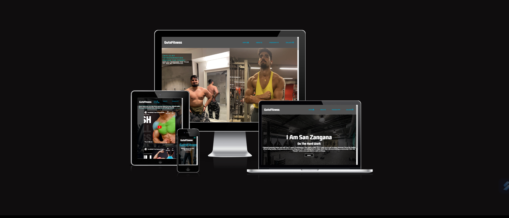
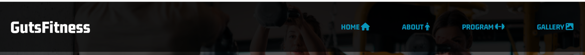
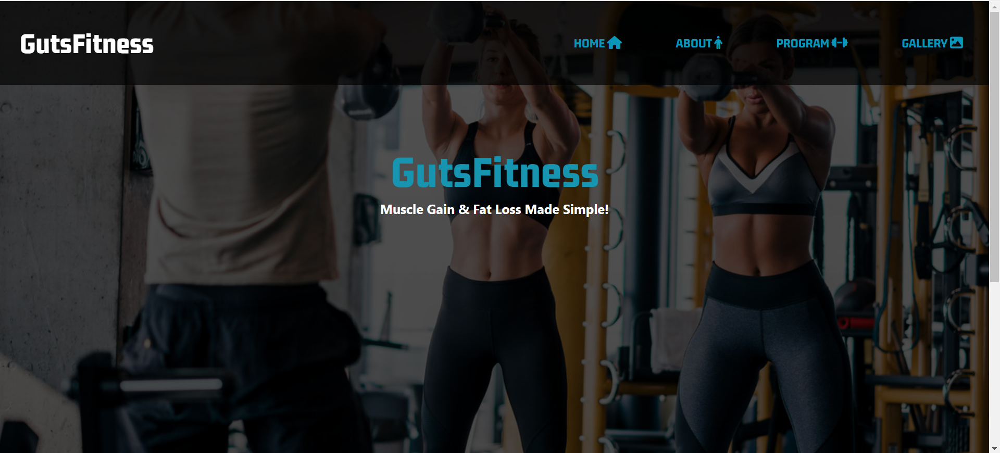
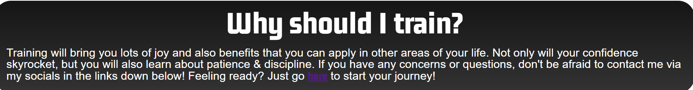
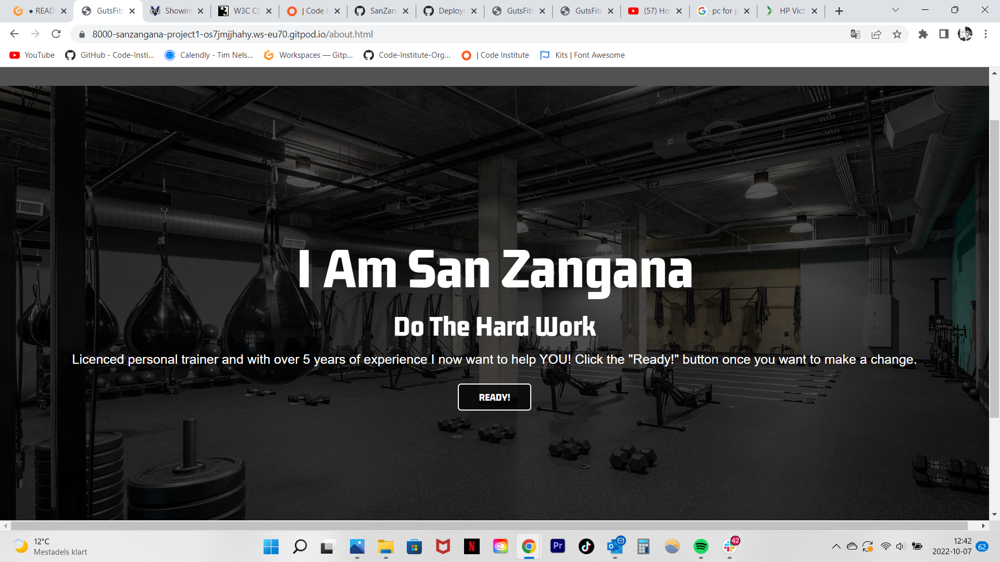
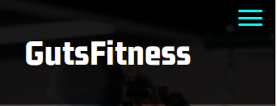
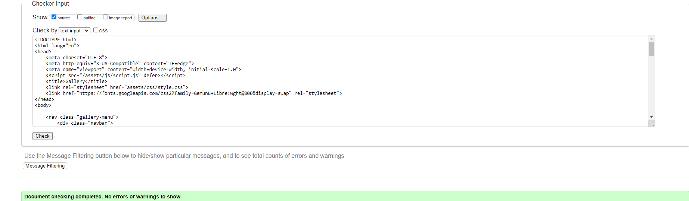
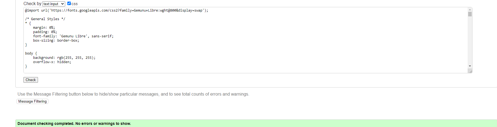
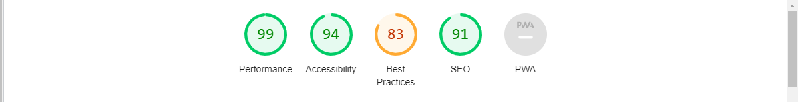

# GutsFitness
I present to you my first ever project with HTML & CSS, GutsFitness!
This website is made primarly for people who might be struggling with fat loss or gaining muscle. 

## Features

### Existing features

- __Navigation bar__

    - Available on all four pages and it includes links to the Logo, Home page, Gallery and Sign Up page and it stays indentical on all the pages, it's also full responsive!
    - The main purpose of this navigation bar is to help the visitor to easily find what they're looking for. 

- __Landing page__
    - This page is structured in a way so the visitor(s) can easily know what this website can provide
    - The paragraph under the title is made to catch the viewers attention

- __Reasons to train__
    - Here the user will have a small section of text that will provide benefits of training
    - This section will make the user more curious and intreseted in checking out the programe

- __The Footer__
    - This section has three links to seperate social media platform to easily come in contact with GutsFitness
    - This will provide a easy way to stay in touch and ask questions regarding the programe

- __About Page__ 
    - This page will introduce the viewer with what the site will provide and some information about the creator behind the  site
    - It also has a "READY!" button linked to the program page so the user easily can access the "program page"

- __Program__
    - This page has two videos from youtube for the user to experience how to train upper and lower body.
- 

- __Gallery__ 
    - The gallery page has several pictures of my personal progress that has been made throughout the years
    - These photos will work as some sort of reference for the visitor so that they get some sort of proof that the programme on this website is  valid

- __Hamburger Menu__
    - When the user is using mobile device the navigation bar turns to a "Hamburger Menu" for them to easily click and see the other accesible pages. This was done with some minor JavaScript.
    
    

### Features Left to Implement
- The feature I would like to add next is some sort of form for the user to fill out, there will be some questions asking what type of goal the user has with the training session that I can provide and also if the user has some questions for me to answer.

## Validator Tests
The tests I ran to see wether or not the integrity of the HTML & CSS was valid were done on W3C. I also ran a perfomance test on Google Lighthouse. Down below I have provided screenshots to show credability and what kind of results I got by doing these tests.
- HTML 
- 

- CSS
- 

- Mobile & Desktop test Lighthouse
 - 
 - 

## Bugs
- Because this was my first ever project I stumbled upon a few bugs that I solved eventually, some of them included the navigation bar not being responsive and other issues appeared that were causing some sort of overflow and the screen got a horizontal scroll-bar.

## Deployment

The site was deployed to GitHub pages. The steps to deploy are as follows: 
  - In the [GitHub repository](https://github.com/SanZangana/gutsfitness), navigate to the Settings tab 
  - From the source section drop-down menu, select the **Main** Branch, then click "Save".
  - The page will be automatically refreshed with a detailed ribbon display to indicate the successful deployment.

The live link can be found on [GitHub Pages](https://sanzangana.github.io/gutsfitness/)

### Local Deployment

In order to make a local copy of this project, you can clone it. In your IDE Terminal, type the following command to clone my repository:

- `https://github.com/SanZangana/gutsfitness`

Alternatively, if using Gitpod, you can click below to create your own workspace using this repository.

## Credit
- I would first and foremost thank my CI Mentor Tim Nelson for guiding me for my first ever project, he has been teaching me how to fix issues regarding the project.
- Code Institutes own modules consisting of videos and valuable information regarding HTML & CSS have also been a great contributor to this website
- The inspiration for this website was not taken from any particular source, I've always been intrested in training and fitness so the website is more of a manifestation of my own ideas.

### Content 

- The icons in the footer were taken from [Font Awesome](https://fontawesome.com/)

### Media
- The youtube videos were taken from [Athleanx Youtube](https://www.youtube.com/channel/UCe0TLA0EsQbE-MjuHXevj2A)
- The background images were taken from Google or other various websites
  - [Program Page](https://www.thetrendspotter.net/how-to-do-lunges/)
  - [Home Page](https://www.runster.gr/stories-epikairathemata-koronaios-ti-isxuei-gia-tous-athlitikous-xorous/04run-gym-videosixteenbyninejumbo1600/)
  - [About Page](https://vickersdesigngroup.com/projects/madabolic/)
  - The picture on the Gallery Pages are pictures on myself, taken with my mobile device.